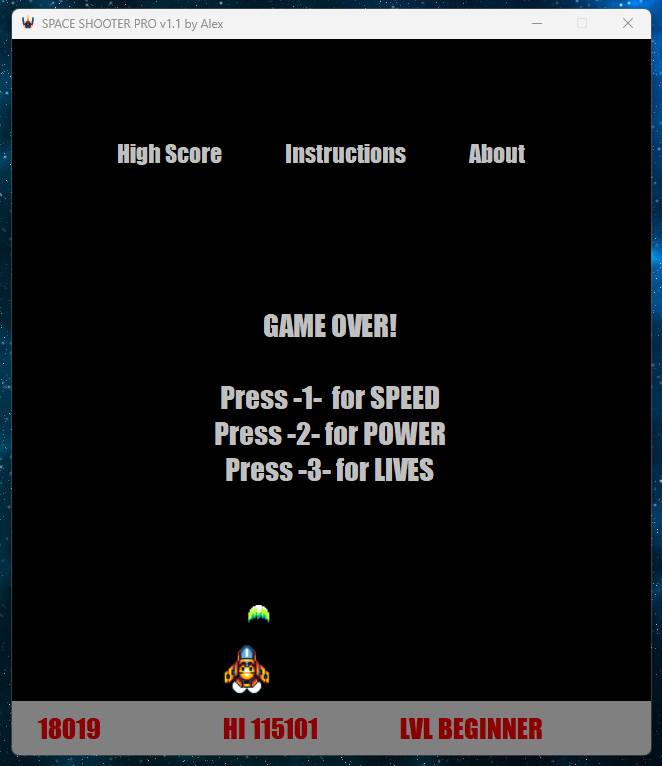

## ✍**Programming in C# DA204E**   
**Project: Space Shooter game in C#**  
**Date:** Summer 2023  
**Grade:** A

---

## **📚 About the Project**  
Learning the basic structure and syntax of the C# language, as well as how to utilize the common features of the .NET Framework to develop programs with graphical user interface.

Note: the highest scores are saved to `highscore.txt`

---

## **🙏 The Game Rules**  
At the start of the game, choose your power-ups for the ship.

Move your ship using the LEFT and RIGHT arrow keys.

Press the SPACE BAR to shoot and destroy enemies.

Get the highest score possible by shooting down all the enemies.

Good luck and have fun! 🚀🚀🚀

---

